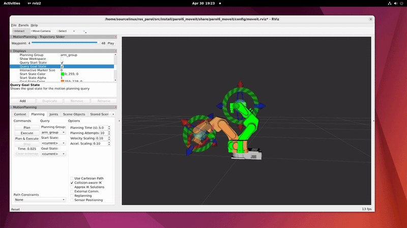

# PAROL6-ROS2-MOVEIT

This repository provides ROS 2 MoveIt 2 integration for the [PAROL6](https://github.com/PCrnjak/PAROL6-Desktop-robot-arm) 6-DOF open-source robotic arm. It includes a simulation demo, URDF models, and launch files for testing and planning.



---

## 🛠️ Installation & Setup

**Tested on:**
- Ubuntu 22.04
- ROS 2 Humble

### 1. Install ROS 2 Humble and MoveIt 2

You can follow [this guide](https://aleksandarhaber.com/how-to-properly-install-moveit2-in-ros2-humble-and-fix-tutorial-errors/) or install via APT:

```bash
sudo apt update
sudo apt install ros-humble-desktop ros-humble-moveit
```

### 1. Create and build a workspace

```bash
mkdir -p ~/ros2_ws/src
cd ~/ros2_ws/src
git clone https://github.com/your_username/PAROL6-ROS2-MOVEIT.git 
## OR Copy this repo manually to ros2_ws/src
cd ~/ros2_ws
colcon build
```

### 1.  Source the environment

```bash
colcon build
source /opt/ros/humble/setup.bash
source install/setup.bash
```

### 🚀 Run the Simulation
```bash
LC_NUMERIC=en_US.UTF-8 ros2 launch parol6_moveit demo.launch.py
```

### 📚 Helpful Resources
- [Link1](https://www.youtube.com/watch?v=M2yiVbJmzKY&list=PLeEzO_sX5H6TNMBiworxO8RpQlcYfl54y&index=10)
- [Link2](https://www.youtube.com/watch?v=nZqTdzGAfYs)


### 🛠️ Troubleshoot

Fix common MoveIt 2 issues : 

```bash
sudo apt install --reinstall ros-humble-geometric-shapes
```

MoveIt Setup Assistant (Optional):
```bash
ros2 run moveit_setup_assistant moveit_setup_assistant
ros2 launch moveit_robot_arm_sim demo.launch.py
```

⚠️ Note: All URDF/XACRO names must be lowercase to avoid issues!
⚠️ Note: - [Common_errors](https://robotics.stackexchange.com/questions/103300/error-loading-custom-robotic-manipulator-model-in-moveit2-on-ros2-humbleerror-l)


### ✅ TODO

- [ ] Connect with real PAROL6 robot
- [ ] Move PAROL6  